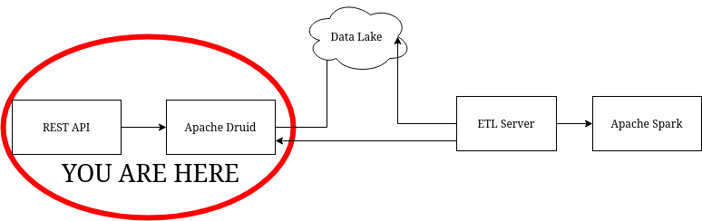

# Simple REST Server
## Introduction
This project is part of a demo to show some of the capabilities of Druid as a OLAP database. It's part of the [demonstration using Spark and Druid](https://github.com/Ruriel-SCIO/demonstration-spark-druid). However, it's still possible to run this code separately for studying purposes.

## What is Apache Druid?
It's a OLAP database designed to read big portions of data in real-time. More information about it can be seen in the [official website](https://druid.apache.org/)

## Architecture

This part of the architecture serves as a interface between Druid and a client, like a user interface or even another REST API.

## Requirements
* Docker 20.10.6
* Docker Compose 1.29.2

The setup is as simple as running a terminal command:
```console
$ docker-compose up --build 
```
Docker will create container and download all the required files. This container assumes Apache Druid is already running. If you want a container that runs a single server version of it, take a look at the [full demo repository](https://github.com/Ruriel-SCIO/demonstration-spark-druid). Otherwise, [you can install Druid on your machine separately](https://druid.apache.org/docs/latest/tutorials/index.html). Remember to double check the docker-compose file to set the location of the Druid server (variable DRUID_SERVER) and the port you want to run the API (variable PORT).
If you want to run the code locally in developer mode, run the following:
```code
$ npm install -g yarn
$ yarn install
$ yarn dev
```

## API
GET /api/dimensions

Runs a SQL query to retrieve the available dimensions of the datasource (which is set as "service" for the purpose of this demonstration).

**Returns**
```json
{
    "dimension" : List(String)
}
```

POST /api/customerCare/amount

Reads a simplified JSON to be used to generate a [Native Query](https://druid.apache.org/docs/latest/querying/querying.html).
The following is a list of each field described.

*   dimensions: List of Strings representing the dimensions. You can send one or more dimensions. This would be the equivalent of the SELECT clause in a SQL query.
        
    * Available data: 
    ```json
    ["identifier","evaluation","duration","operator","status","client","phone"]
    ```
* granularity: The level of time granularity you want the data to be grouped. For instance, if you want
to see the counting by day, set the granularity as 'day'. For month, set it as 'month'. You can see more about granularity [here](https://druid.apache.org/docs/latest/querying/granularities.html).
    
    * Available data: If none of the following is sent, the API will default to "all".
    ```json
    ["all","none","second","minute","fifteen_minute", "thirty_minute","hour","day","week","month","quarter","year"]
    ```
* dateStart: The start date used to create the interval the queried data will belong. Follows the format YYYY-MM-dd. Defaults to today.
    * Available data: The dates varies from 2021-01-01 to 2021-05-24.
* dateEnd: The end date used to create the interval the queried data will belong. Follows the format YYYY-MM-dd. Defaults to dateStart.
    * Available data: The dates varies from 2021-01-01 to 2021-05-24.
* filter: A simplified object used to describe a sequence of expression equivalent to a WHERE clause. In this demo, only simple expressions are valid, such as "A or B and C". The result is used to generate a [selector filter](https://druid.apache.org/docs/latest/querying/filters.html#selector-filter). Since the mock data has 10000 lines, you can keep querying using only the "dimension" field and using the data shown in the events to query for specific values.
    * Each object has the following schema:
    ```
    {
        "name" : The name of the dimension. Ignored if "type" is "logic".
        "value" : The value searched or the boolean operand ("or", "and", etc)
        "type" : The type of the value. In this demonstration, it's only used for "logic" type.
    }
    ```

**Input**
```json
{
    "dimensions": List(String),
    "granularity" : String,
    "dateStart": Date(YYYY-MM-dd),
    "dateEnd" : Date(YYYY-MM-dd),
    "filter" : List(filterElements)
}
```

**Returns**
```json
[
    {
        "timestamp" : Timestamp,
        "events": [
            {
                "count" : Long,
                (Any dimension requested) : (The value of that dimension)
            }
        ]
    }
]
```
## Code Structure
* app
    * controller
        * druidController.js: A controller that will sent the data to Druid. In this version, we use two endpoints that POSTS either a SQL query or a Native Query to Druid.
    * routes
        * createRouter.js: Reads the subfolders to generate a Router using each route file configuration.
        * customerCare/amount.js: The route used to send the data that will generate a native query to Druid.
        * dimensions/index.js: The route that will send a SQL query to Druid asking for the available dimensions.
    * services
        * customerCareService.js: The service that will receive a the body of the request and, using the utils functions, generate a native query to send to Druid via druidController.
        * dimensionService.js: Creates a SQL query to retrieve the dimensions from Druid. Since Druid returns a stringfied JSON, parses it and returns as a object.
    * utils
        * dataFormatter.js: Used to format the output data generated by Druid into a more friendly format. It only has a function to group the events by timestamp.
        * nativeQueryBuilder: This is where we process the data sent in the body of the request to generate a Native Query.
* config
    * serverConfig: Sets up the configuration for Express.
* main.js: The file responsible to start the application.